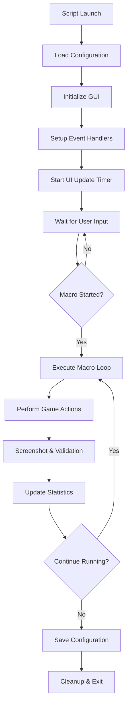

# Revolution Idle Helper

Advanced automation tool for the Revolution Idle game with comprehensive macro system and coordinate management.

## Table of Contents
- [Overview](#overview)
- [Features](#features)
- [Prerequisites](#prerequisites)
- [Installation](#installation)
- [Configuration](#configuration)
- [Quick Usage](#quick-usage)
- [GUI Reference](#gui-reference)
- [Examples](#examples)
- [Architecture and Flow](#architecture-and-flow)
- [Errors and Troubleshooting](#errors-and-troubleshooting)
- [Security](#security)
- [Limitations and Roadmap](#limitations-and-roadmap)
- [Tests](#tests)
- [Performance](#performance)
- [Compatibility](#compatibility)
- [License](#license)

## Overview

Revolution Idle Helper is an AutoHotkey v2 automation script designed for the Revolution Idle game. It provides automated gameplay through configurable macros, intelligent coordinate management, and real-time performance monitoring. The tool features a hierarchical GUI with collapsible sections, visual coordinate picker, and comprehensive settings management.

Target audience: Revolution Idle players seeking to automate repetitive gameplay tasks while maintaining full control over automation parameters.

## Features

- **9 Pre-configured Macros**: Standard, Quick, Long, Endgame, Time Warp, Auto Clicker, Time Flux Buy, Auto Unity, Zodiac Redistribution
- **Visual Coordinate Picker**: Click-to-capture system with real-time coordinate updates
- **Hierarchical Settings Organization**: Collapsible sections for Refining, Unity Parameters, and Other Tools
- **Game State Management**: Early, Mid, Late, and Custom progression states with optimized parameters
- **Real-time Performance Monitoring**: Cycle statistics, average completion times, screenshot capture
- **Automatic Configuration Management**: Periodic auto-save with exit persistence
- **Hotkey Controls**: F5-F10 for macro control, Esc for coordinate picker cancellation
- **Compact Mode**: Minimized eye-icon interface for reduced screen footprint
- **Screenshot Integration**: Automated capture with cleanup and preview functionality

## Prerequisites

- **Operating System**: Windows 10 or later
- **AutoHotkey**: Version 2.0 or later
- **Game**: Revolution Idle (must be running)
- **Permissions**: Standard user permissions (no administrator rights required)
- **Display**: Minimum 1920x1080 resolution recommended for coordinate accuracy

## Installation

### Windows

1. **Install AutoHotkey v2**:
   ```powershell
   # Download from https://www.autohotkey.com/
   # Or using winget:
   winget install AutoHotkey.AutoHotkey
   ```

2. **Download the script**:
   ```powershell
   # Clone or download RevolutionIdleHelper_v1.2.ahk
   ```

3. **Launch the script**:
   ```powershell
   # Double-click the .ahk file or run:
   "C:\Program Files\AutoHotkey\v2\AutoHotkey64.exe" "RevolutionIdleHelper_v1.2.ahk"
   ```

## Configuration

The script automatically creates `RevolutionIdleHelper_v1.2.ini` with default settings. All configuration is managed through the GUI interface.

### Configuration File Structure

| Section | Description | Location |
|---------|-------------|----------|
| `[UI]` | Window position | Auto-managed |
| `[Settings]` | Core macro parameters | GUI Settings |
| `[FineSettings]` | Toggle switches | GUI Fine Settings |
| `[Unlockables]` | Automation features | GUI Unlockables |
| `[UnityParameters]` | Zodiac elements, time warp | GUI Unity Parameters |
| `[Sections]` | GUI visibility states | Auto-managed |
| `[Coordinates]` | Game click positions | GUI Coordinate Picker |

### Key Configuration Parameters

| Parameter | Type | Default | Description |
|-----------|------|---------|-------------|
| `Macro` | string | "standard" | Active macro type |
| `GameState` | string | "early" | Game progression state |
| `MineralLevel` | string | "999" | Highest mineral level to spawn |
| `MergeWaitTime` | string | "5000" | Merge delay in milliseconds |
| `TimewarpInterval` | string | "1000" | Time warp burst interval |
| `MicroDelayMs` | integer | 25 | Action delay in milliseconds |

## Quick Usage

1. **Start Revolution Idle game**
2. **Launch the script** - GUI appears at default position (12, 51)
3. **Configure coordinates** (first-time setup):
   - Navigate to "Other Tools > Coordinate Settings"
   - Double-click any coordinate to enter picker mode
   - Click the target location in-game
   - Press Esc to cancel if needed
4. **Select macro and settings**:
   - Choose macro type from the main buttons
   - Adjust parameters in respective sections
5. **Start automation**:
   - Press F5 or click "F5: Start macro"
   - Monitor performance in Statistics section

## GUI Reference

### Main Controls
| Control | Function | Hotkey |
|---------|----------|--------|
| Start/Stop | Toggle macro execution | F5 |
| Cycle Macro | Switch between macro types | F6 |
| Cycle Game State | Switch progression states | F7 |
| Toggle Compact | Minimize to eye icon | F10 |
| Exit Application | Close script | Esc |

### Macro Types
| Macro | Description | Use Case |
|-------|-------------|----------|
| Standard | Balanced refining and spawning | General gameplay |
| Quick | Fast cycles with minimal delays | Active monitoring |
| Long | Extended cycles with longer waits | Idle gameplay |
| Endgame | Optimized for late-game content | Advanced progression |
| Time Warp | Automated time warp management | Time acceleration |
| Auto Clicker | Continuous clicking automation | Specific grinding |
| Time Flux Buy | Automated time flux purchasing | Resource management |
| Auto Unity | Automated unity operations | Unity progression |
| Zodiac Redistribution | Automated zodiac element rebalancing | Optimization |

### Section Organization
- **Refining**: Core macro controls and statistics
- **Unity Parameters**: Zodiac elements and time warp settings
- **Other Tools**: General parameters and coordinate management

## Examples

### Example 1: Basic Setup
```autohotkey
# 1. Launch script
# 2. Set game state to "Late"
# 3. Select "Standard" macro
# 4. Press F5 to start
# Expected: Automated refining cycles with default 1000ms merge wait
```

### Example 2: Coordinate Recalibration
```autohotkey
# 1. Open Other Tools > Coordinate Settings
# 2. Double-click "spawn" coordinate
# 3. Script enters compact mode with instruction box
# 4. Click the spawn button in Revolution Idle
# 5. Coordinate automatically updates and saves
# Expected: Accurate targeting for spawn operations
```

## Architecture and Flow

The script follows a modular architecture with clear separation of concerns:



### Core Components
- **State Management**: Centralized state with atomic operations
- **UI Manager**: Hierarchical GUI with dynamic sections
- **Configuration Manager**: INI file handling with validation
- **Action System**: Game interaction with coordinate management
- **Macro Engine**: Sequence execution with error handling
- **Coordinate Picker**: Visual coordinate capture system

## Errors and Troubleshooting

| Error Message | Probable Cause | Solution |
|---------------|----------------|----------|
| "Target process not found" | Revolution Idle not running | Launch the game before starting macro |
| "Invalid callback function" | AutoHotkey version conflict | Ensure AutoHotkey v2.0+ is installed |
| Unresponsive GUI | High CPU usage | Reduce macro frequency or check system resources |
| Coordinate picker not working | Screen resolution change | Recalibrate coordinates using picker |
| Macro stops unexpectedly | Game window lost focus | Keep Revolution Idle visible and active |

### Common Issues
- **Performance lag**: Increase MicroDelayMs value (default: 25ms)
- **Missed clicks**: Recalibrate coordinates or adjust game window position
- **Configuration not saving**: Check file permissions in script directory

## Security

### Data Handling
- **Configuration Storage**: Local INI files in script directory
- **No Network Communication**: Script operates entirely offline
- **No Sensitive Data Collection**: Only game coordinates and user preferences stored
- **File Permissions**: Standard user-level file access only

### Best Practices
- Run with standard user privileges (no administrator required)
- Keep script files in a dedicated directory
- Regular backup of configuration files recommended
- Monitor script behavior during initial setup

## Tests

### Manual Testing Checklist
- [ ] All 9 macros execute without errors
- [ ] Coordinate picker captures accurate positions
- [ ] Configuration saves and loads correctly
- [ ] Hotkeys respond appropriately
- [ ] GUI sections collapse/expand properly
- [ ] Statistics update in real-time

### Test Data
- **Coordinate validation**: Use known game element positions
- **Macro timing**: Verify delays match configured values
- **Error handling**: Test with game closed/minimized


## Performance

### Typical Performance
- **Memory Usage**: ~15-25 MB during operation
- **CPU Impact**: <5% on modern systems during macro execution
- **Response Time**: UI interactions <100ms, coordinate picker <50ms
- **Macro Cycle Time**: 30-300 seconds depending on configuration

### Optimization Parameters
- **UI Update Interval**: 250ms (configurable via code)
- **Auto-save Frequency**: 10 seconds
- **Screenshot Retention**: Configurable file count and age limits

### Resource Requirements
- **Disk Space**: <1 MB for script and configuration
- **Network**: None (fully offline operation)
- **Graphics**: Standard desktop compositing

## Compatibility

### Operating Systems
- **Windows 10**: Full support
- **Windows 11**: Full support
- **macOS**: Not supported (AutoHotkey limitation)
- **Linux**: Not supported (AutoHotkey limitation)

### Dependencies
- **AutoHotkey**: v2.0 minimum, v2.0.2+ recommended
- **Windows API**: GDI+ for screenshot functionality
- **Revolution Idle**: Current version compatibility

### Hardware Requirements
- **CPU**: Any x64 processor
- **RAM**: 4 GB minimum
- **Display**: 1920x1080 minimum resolution
- **Input**: Standard mouse and keyboard


## User Guide

### Basic Hotkeys

| Key | Function | Description |
|-----|----------|-------------|
| **F5** | Start/Stop Macro | Toggle the currently selected macro on/off |
| **F10** | Minimize GUI | Minimizes the GUI to an eye icon |
| **Esc** | Exit Application | Closes the application (or exits coordinate picker mode) |

### Coordinate Settings

This script uses screen coordinates and doesn't modify the game's code or read game values. It simply controls your mouse and keyboard. For proper functionality:

- **Run the game in windowed mode**
- **Configure coordinates for your screen resolution**
- Default coordinates may not work due to different screen/game resolutions

**Setting up coordinates (Version 1.2):**
1. Navigate to **Other Tools > Coordinate Settings**
2. Double-click any coordinate in the list
3. Click on the corresponding button/area in the game
4. The coordinate will be automatically saved

### Minerals & Refining Helper

Automates the mineral spawning, polishing, and refining loop to maximize RfT (Refine Tree) points gain.

#### 1. Standard Macro Types

| Macro | Sequence | Best For |
|-------|----------|----------|
| **Standard** | Spawn → Polish → Long Spawn → Merge → Refine | Balanced, general use |
| **Quick** | Spawn → Polish → Refine | Fast cycles, active monitoring |
| **Long** | Spawn → Polish → Spawn Loop → Merge → Polish → Spawn Loop → Merge → Refine | Maximum mineral levels |

*Note: Quick macro is often optimal, with exceptions based on progression level.*

#### 2. Game Statistics

- **Screenshot Area**: Displays current RfT points or other values
- **Cycle Count**: Number of completed macro loops
- **Average Length**: Time per cycle for calculating RfT per second

To configure the screenshot area, edit the capture rectangle coordinates in the code.

#### 3. Game State Presets

Configure spawn and polish cycles based on your progression:

| State | Spawn Cycles | Polish Cycles | Description |
|-------|-------------|---------------|-------------|
| **Early** | 7 | 3 | Multiple spawns needed to reach highest level |
| **Mid** | 5 | 2 | Moderate efficiency |
| **Late** | 4 | 1 | High efficiency, few cycles needed |
| **Custom** | Your choice | Your choice | Fully customizable |

- **Spawn Cycles**: Number of highest mineral spawns before polishing
- **Polish Cycles**: Number of weapon polish rounds before final refining

#### 4. Fine Settings

| Setting | Options | Description |
|---------|---------|-------------|
| **Auto Refining** | On/Off | Whether macro performs refining at the end |
| **Auto RfT Upgrade** | On/Off | Automatically buys selected RfT Node during long runs |
| **Weapon Polish** | All Weapons/Sword Only | Before auto-polish unlock, sword-only is more efficient |

#### 5. Automation Unlockables

Configure based on your game progression:

| Unlockable | Effect When Disabled | Effect When Enabled |
|------------|---------------------|-------------------|
| **Autospawn** | Script clicks spawn buttons manually | Script toggles autospawn on/off |
| **Automerge** | No mineral merging, merge cycles become spawn cycles | Script uses automatic merging |
| **Auto Max Level** | Script manually buys Max Level upgrade | Script lets the game auto-upgrade |
| **Auto Weapon Polish** | Script clicks an polish each weapon individually | Script uses automatic polishing |

⚠️ **Warnings:**
- **Max Level**: Don't move the VP upgrade window after setting coordinates
- **Weapon Polish**: Ensure all weapons are visible when setting coordinates

#### 6. Variables

| Variable | Description | Notes |
|----------|-------------|-------|
| **Highest Mineral Level** | Maximum affordable mineral level | Start with 999, adjust as needed |
| **Merge Wait Time** | Delay during merge loops (milliseconds) | Default: 5000ms |
| **Time Warp // Burst Interval** | Time between time warp bursts (milliseconds) | Default: 1000ms |
| **Time Warp // Minutes to Spend** | Minutes of Time Flux to spend per burst | Default: 10 |
| **Exploit Wait Time** | Delay for endgame exploit (milliseconds) | See Endgame Exploit section |

#### 7. Endgame Exploit

⚠️ **WARNING**: This exploits a game bug and may be considered cheating. Use at your own risk.

**How it works**: Exploits a brief window when changing mineral levels to purchase normally unaffordable minerals.

**Setup**:
- Disable **Auto Refining** when farming high-level minerals
- Set appropriate **Exploit Wait Time** for your system
- Enable **Auto Refining** to integrate exploit into standard cycles

### Unity Helper

Tools for optimizing zodiac elements and unity operations.

#### 1. Auto Unity

Enhanced version of in-game auto-unity with time warp integration:

- **Time Warp Before Unity**: Spend Time Flux before uniting
- **Zodiac Selection**: Choose specific zodiac elements
- **Repetition Control**: Set number of macro repetitions
- **Planet Loadout Support**: Requires late-game macro for loadout switching

*Requirements: Large Time Flux reserves, late-game progression*

#### 2. Auto Zodiac Redistribution

Automates zodiac stat redistribution until desired stats are achieved:

- Set **Redistribution Wait Time** for reaction time
- Monitor stats and stop macro when satisfied
- Useful for optimizing zodiac bonuses

### Other Tools

#### 1. Autoclicker

Basic autoclicker functionality:
- Clicks at current mouse position
- Useful for achievements and special mechanics
- Continuous clicking while macro is active

#### 2. Time Warp Burst

Automated time warp management for efficient Time Flux spending:

**Configuration**:
- **Minutes to Spend**: Total Time Flux minutes per session
- **Burst Interval**: Time between start/stop cycles

**Example**: 
- Minutes to Spend: 10
- Burst Interval: 1000ms (1 second)
- Result: 1-minute bursts with 1-second gaps

**Use Cases**:
- Early-game magnet farming
- Controlled Time Flux consumption
- Automated time acceleration

#### 3. Time Flux Buy

⚠️ **Disclaimer**: Intended for testing with cheat modes only.

Rapidly purchases 24-hour Time Flux from the shop. Only recommended if using cheats that make shop purchases free.

---

**Note**: This script is an automation tool for educational and convenience purposes. Users are responsible for ensuring compliance with Revolution Idle's terms of service and any applicable gaming platform policies.
